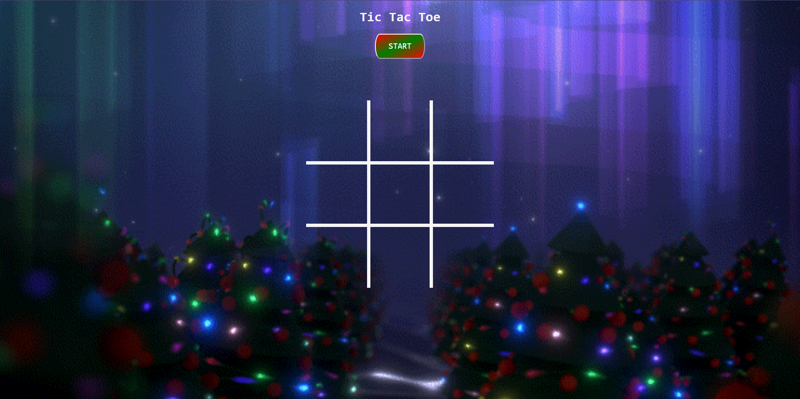
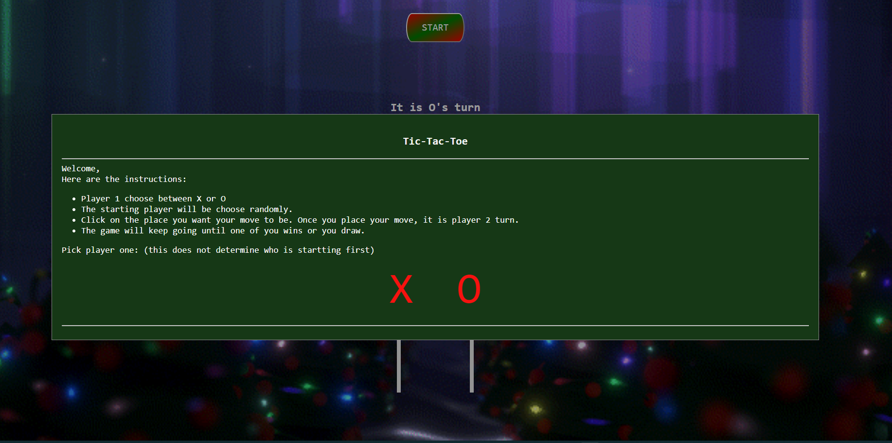
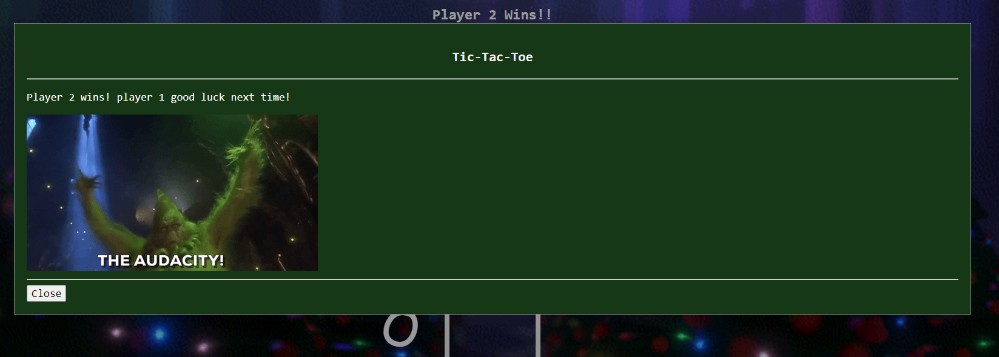
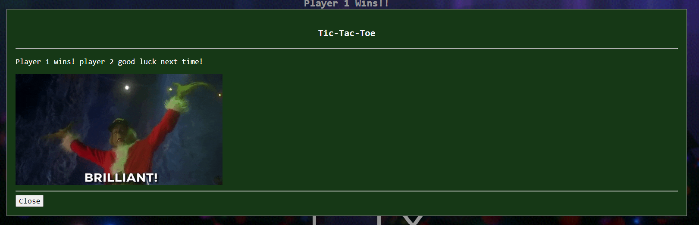
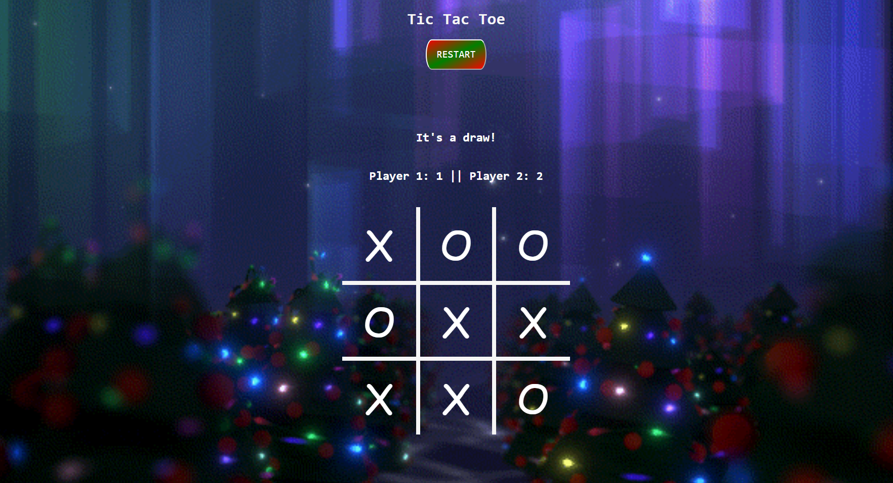

# TicTacToe
Tic Tac Toe is a two-player game where each take turns marking spaces in a 3x3 board with X or O makrs. The player who wins is determined by placing 3 of the same marks diagonal, row or column. If both players fail to do so, it is an authomatic draw. 

## About the project
This is the christmas version of the classic game of tic tac toe. Where the player who starts the game is completetly random. The game structure: 
- The game starts when the user clicks the **Start** button 
- After that player 1 will select their mark (either X or O) and the game will start. 
- Once either player gets into the winning state the modal will display with a message and a gif. Depending on the player that wins, a different message will be dsiplayed and the win counter will increase. 
- If neither can get a win a draw message will display. 

## How the project looks
1. Beginnning of the game:

2. Welcome/Instructions:

3.Player 2 wins: 

4. Player 1 wins:

5. Draw game status message: 

## Link to the live project
[Click here to acces the project!](https://oricruz.github.io/TicTacToeGame/)

## Installation instructions
1. **Clone or fork the repository**
> Using your terminal copy the following code: 
> `git clone https://github.com/OriCruz/TicTacToeGame.git`
2. **Using VSCode, launch index.html with the live server extension**

## Technologies used
- **HTML** for website formatting.
- **CSS** for styling the webpage.
- **JavaScript** for DOM manipulation.

## Acknoledgements
Images:
 
- https://giphy.com/  

Resources: 

- https://dev.to/bornasepic/pure-and-simple-tic-tac-toe-with-javascript-4pgn
- https://www.youtube.com/watch?v=AnmwHjpEhtA&t=12s
- Cycle 28 Per Scholas team.
- https://www.youtube.com/watch?v=-JqILmKs1RE